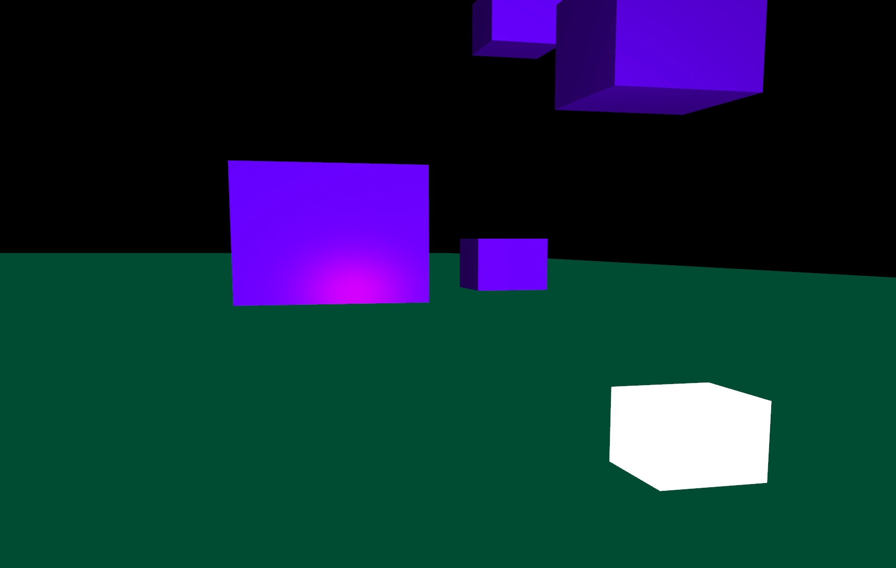
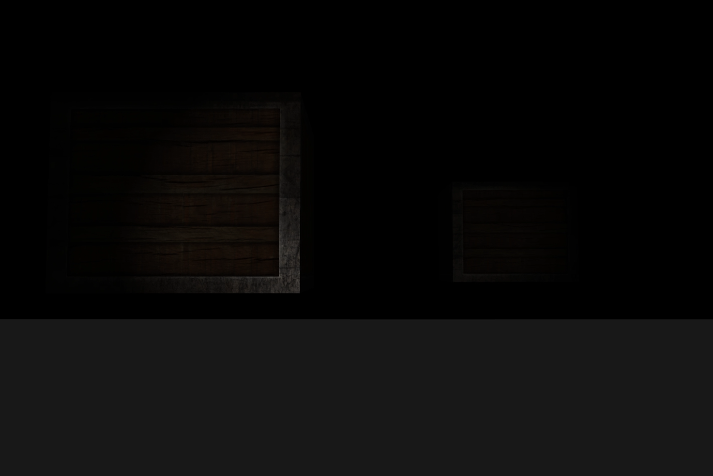

# RenderingEngine_V1
A lightweight rendering engine built in C++ using modern OpenGL. Created as a hands-on project to learn graphics programming, including shaders, textures, camera controls, and a basic rendering pipeline. Intended as a foundation for future graphics experiments.

Below are some examples of renders made with the engine. 

